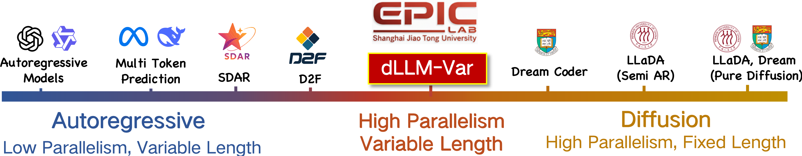

# dLLM-Var: Diffusion LLM with Native Variable Generation Lengths
[](https://huggingface.co/maomaocun/dLLM-Var) [](LICENSE)

**Diffusion LLM with Native Variable Generation Lengths: Let [EOS] Lead the Way**

Authors: Yicun Yang<sup>1 *</sup>, Cong Wang<sup>1</sup>, Shaobo Wang<sup>1</sup>, Zichen Wen<sup>1</sup>, Biqing Qi<sup>2</sup>, Hanlin Xu<sup>3</sup>, Linfeng Zhang<sup>1 †</sup>  
Affiliations: <sup>1</sup>Shanghai Jiao Tong University, <sup>2</sup>Shanghai AI Lab, <sup>3</sup>Huawei  

[Paper](https://arxiv.org/abs/2510.24605) | [Hugging Face Model](https://huggingface.co/maomaocun/dLLM-Var)

### Key Features
- **Native Variable-Length Generation**: Guided by the [EOS] token, it supports arbitrary length output without fixed hyperparameters.
- **High Parallelism**: Inherits the bidirectional attention of dLLM, supporting blockwise diffusion inference.
- **KV Cache Compatible**: Seamlessly reuses the KV cache, avoiding complex designs and improving efficiency.
- **Self-Correction Capability**: The full attention mechanism allows subsequent blocks to edit and correct previously generated ones.

<div align="center">

</div>

*Figure 1: The evolution of probabilistic modeling paradigms for text generation. From autoregressive (AR) to diffusion-based methods. dLLM-Var achieves variable-length generation while maintaining high parallelism.*  

## Installation
### Requirements
- Python 3.12
- PyTorch 2.5+ (H-series GPUs support FP8 mixed precision)
- DeepSpeed (for training)
- Transformers, Datasets

### Quick Installation
```bash
# Clone the repository
git clone https://github.com/maomaocun/dLLM-Var.git
cd dLLM-Var
bash install.sh
```
## Quick Start
### Demo
```python
demo_dLLM-var.py
```
### Prepare Dataset
```python
cd datset
python transfer_text2token.py --input_dir "path/to/your/input/jsonl/folder" --output_file "path/to/your/output/tokenized.jsonl" --tokenizer_model "path/to/your/LLaDA-8B-Base"
```
For detailed dataset format, see `/sft_training/data/dataset.py`.

### Training Script
Training uses DeepSpeed ZeRO-2 and supports multi-GPU. Example command:
```bash
cd ./sft_training
bash run_gpus_fp8.sh
```
For detailed training configuration, see ` ./sft_training/config/sft/default_config.yaml`.


## Citation
If you find this work useful, please cite:
```
@misc{yang2025diffusionllmnativevariable,
      title={Diffusion LLM with Native Variable Generation Lengths: Let [EOS] Lead the Way}, 
      author={Yicun Yang and Cong Wang and Shaobo Wang and Zichen Wen and Biqing Qi and Hanlin Xu and Linfeng Zhang},
      year={2025},
      eprint={2510.24605},
      archivePrefix={arXiv},
      primaryClass={cs.CL},
      url={https://arxiv.org/abs/2510.24605}, 
}
```

## License
MIT License.

## Contact
- Project Lead: yangyicun187@gmail.com
- Corresponding Author: zhanglinfeng@sjtu.edu.cn